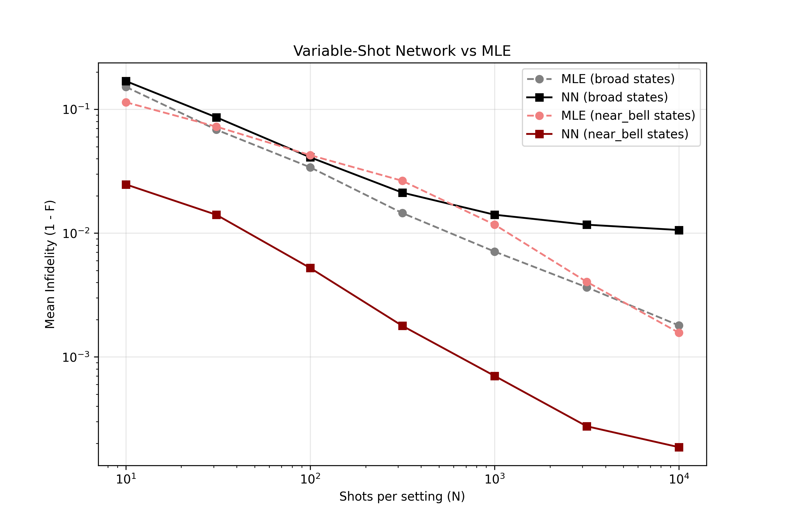

# Two-Qubit State Tomography: Readout Chains and Neural Network Priors

A self-contained project on **quantum state tomography**: reconstructing the density matrix of two qubits from measurement statistics. The pipeline evaluates ideal discrete readouts, simulated analog readout chains using machine learning classifiers (from [Qubit-Readout-ML](https://github.com/samuelnoger/Qubit-Readout-ML)), and finite-shot reconstruction using neural network priors.





---

## Background

A two-qubit density matrix $\rho$ has 15 real parameters. Measuring each qubit in the $X$, $Y$, or $Z$ basis yields 9 measurement settings with four outcomes each. Reconstruction from finite shots ($N$) is a statistical estimate, evaluated by the infidelity $1 - F$ against the true state.

## Methods

**Reconstruction Estimators:**
- *Linear inversion with projection:* Estimates Pauli correlators from counts, projecting the result onto the nearest physical state.
- *Maximum likelihood (MLE):* Iterative solver ensuring the estimate remains positive semi-definite and trace-preserving.
- *Neural Network (Prior-based):* A 37-dimensional input MLP (36 empirical frequencies + $\log_{10}N$) mapping finite-shot measurement statistics directly to a positive semi-definite density matrix via Cholesky parameterization.

**Readout chain:** 
The QuTiP simulator implements $T_1$ decay, dispersive cavity response, and multi-qubit crosstalk. A classifier (1D CNN, Joint LDA, or Matched Filter) predicts the bit string. Reconstructions through the chain are performed either naively or corrected via MLE using a calibrated confusion matrix.

## Results

### Ideal readout
- **Bell states:** MLE falls as $1/N$ and reaches roughly $10^{-6}$ at $3 \times 10^5$ shots. Linear inversion falls as $1/\sqrt{N}$.
- **Random pure and mixed states:** Both estimators scale roughly as $1/\sqrt{N}$ (pure) and $1/N$ (mixed) at high shot counts.

### Neural Network vs. MLE (Variable Shots)
- **Localized Prior (`near_bell`):** Outperforms Maximum Likelihood Estimation at low shot counts by leveraging the learned manifold of the target physical boundary.
- **General Prior (`broad`):** Underperforms MLE in the low-shot regime. The conditional-mean bias of MSE loss forces the broad network to predict the maximally mixed state ($I/4$) when finite-shot data is highly ambiguous.

### Through the readout chain
- **Ignoring readout errors yields a hard noise floor:** Without correction, infidelity plateaus. More shots do not improve the reconstruction.
- **A calibrated correction recovers scaling:** With MLE correction, the infidelity resumes falling with the number of shots. 
- **Classifier impact:** Uncorrected, the matched filter performs worse than the LDA or CNN. With correction, the CNN and LDA perform similarly and slightly outperform the matched filter.

## Development Methodology

The core CNN architecture, QuTiP simulation boilerplate, and classical baselines were scaffolded with the assistance of AI coding tools. Primary technical contributions focus on structuring the quantum state tomography math (Maximum Likelihood Estimation and Linear Inversion), designing the physical simulation to isolate multi-qubit crosstalk, decoupling analog data generation pools for high-shot scaling, and engineering variable-shot neural network architectures to benchmark learned priors against fundamental statistical limits.

## Quick start
```bash
pip install -r requirements.txt

# 1. Classical Baselines & Readout Classification
python -m tomography.ideal_tomography --shots 30 300 3000 30000 300000 --mle-iters 2000
python -m tomography.readout_tomography \
    --shots 100 300 1000 3000 10000 30000 100000 \
    --n-states 50 --n-cal 20000 --n-cal-true 40000 --mle-iters 2000

# 2. Neural Network State Tomography
./run_neural_tomo.sh
python -m tomography.variable_cross_eval