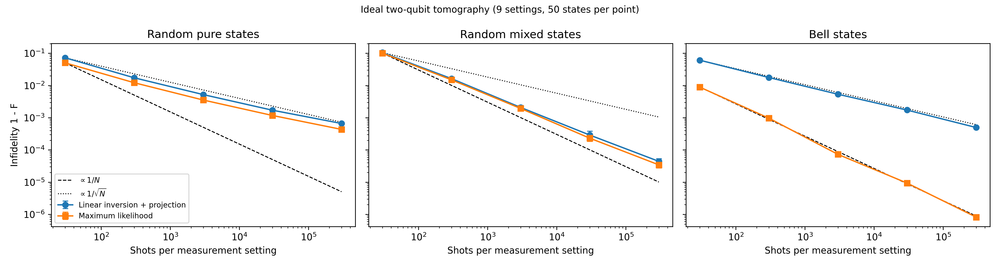
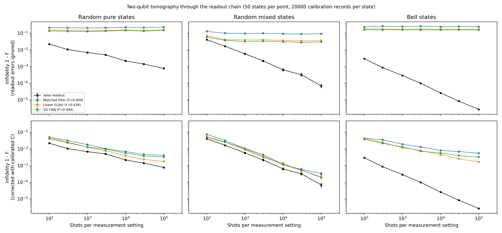
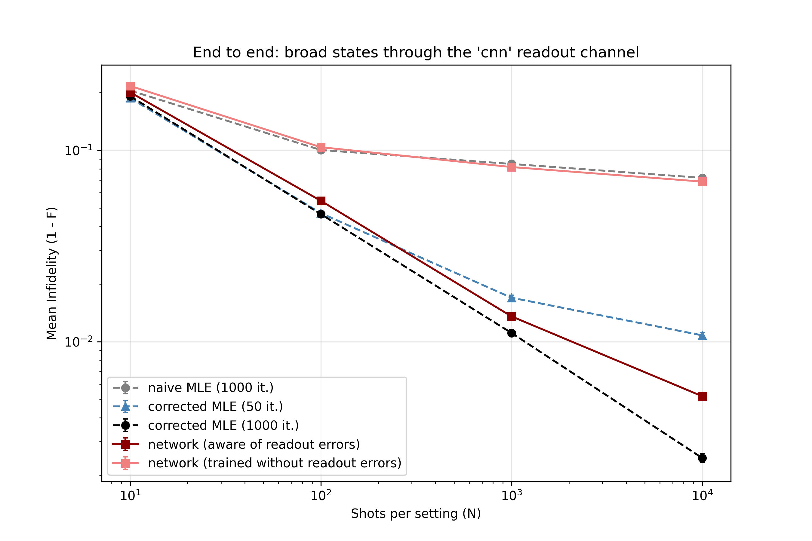
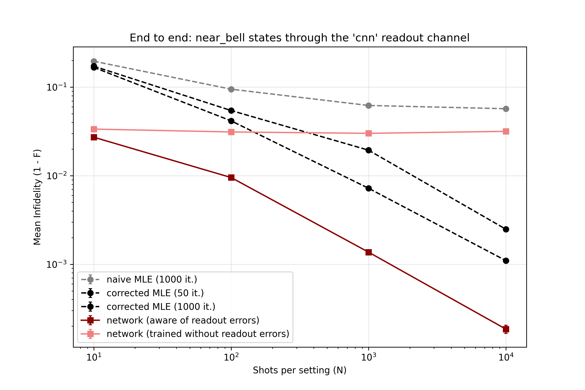

# Two-Qubit State Tomography: Readout Chains and Neural Network Priors

A self-contained project on **quantum state tomography**: reconstructing the density matrix of two qubits from measurement statistics. The pipeline evaluates ideal discrete readouts, simulated analog readout chains using machine learning classifiers (from [Qubit-Readout-ML](https://github.com/samuelnoger/Qubit-Readout-ML)), and finite-shot reconstruction using neural network priors.

---

## Background

A two-qubit density matrix $\rho$ has 15 real parameters. Measuring each qubit in the $X$, $Y$, or $Z$ basis yields 9 measurement settings with four outcomes each. Reconstruction from finite shots ($N$) is a statistical estimate, evaluated by the infidelity $1 - F$ against the true state.

## Methods

**Reconstruction Estimators:**
- *Linear inversion with projection:* Estimates Pauli correlators from counts, projecting the result onto the nearest physical state.
- *Maximum likelihood (MLE):* Iterative solver ensuring the estimate remains positive semi-definite and trace-preserving.
- *Parametric MLE:* A model-based maximum likelihood optimizer constrained explicitly to a 7-parameter near-Bell generation manifold.
- *Neural Network (Prior-based):* A 37-dimensional input MLP (36 empirical frequencies + $\log_{10}N$) mapping finite-shot measurement statistics directly to a positive semi-definite density matrix via Cholesky parameterization.

**Readout chain:** 
The QuTiP simulator implements $T_1$ decay, dispersive cavity response, and multi-qubit crosstalk. A classifier (1D CNN, Joint LDA, or Matched Filter) predicts the bit string. Reconstructions through the chain are performed either naively or corrected via MLE using a calibrated confusion matrix.

## Results

### Ideal Readout


- **Bell states:** MLE falls as $1/N$ and reaches roughly $10^{-6}$ at $3 \times 10^5$ shots. Linear inversion falls as $1/\sqrt{N}$.
- **Random pure and mixed states:** Both estimators scale roughly as $1/\sqrt{N}$ (pure) and $1/N$ (mixed) at high shot counts.

### Readout Chain & Classifier Benchmarking


- **Ignoring readout errors yields a hard noise floor:** Without correction, infidelity plateaus. More shots do not improve the reconstruction.
- **A calibrated correction recovers scaling:** With MLE correction, the infidelity resumes falling with the number of shots. 
- **Classifier impact:** Uncorrected, the matched filter performs worse than the LDA or CNN. With correction, the CNN and LDA perform similarly and slightly outperform the matched filter.

### End-to-End Reconstruction Through Readout Noise

<p align="center">
  
  
</p>

Evaluating reconstruction on counts passed through the CNN classifier's confusion matrix benchmarks whether networks can implicitly invert the readout channel:

- **Unaware estimators hit a noise floor:** Both naive MLE and the network trained on ideal counts plateau at infidelities of $10^{-2}$ to $10^{-1}$. Additional measurement shots provide no benefit because classification bias dominates statistical error.
- **Implicit error mitigation:** The channel-aware network recovers standard finite-shot scaling alongside the corrected classical solvers, proving that a single feedforward pass can perform simultaneous channel inversion and state projection.
- **Broad ensemble performance:** For generic states, converged corrected MLE (1000 iterations) achieves lower asymptotic infidelity at $N \ge 10^3$ ($2.7 \times 10^{-3}$ vs. $5.9 \times 10^{-3}$ at $10^4$ shots), reflecting the asymptotic efficiency of MLE when no low-dimensional prior exists.
- **Near-Bell ensemble and parametric bounds:** On structured states, the aware network outperforms generic corrected MLE across all shot regimes. Compared to the 7-parameter Parametric MLE, the network matches its asymptotic performance at $10^4$ shots ($\sim 2.8 \times 10^{-4}$ vs. $2.5 \times 10^{-4}$) and achieves lower infidelity at low shot counts ($N \le 100$).

### Hardware-Aware Inference Speed
The neural network provides a massive reduction in reconstruction latency compared to classical solvers, while implicitly absorbing the physical readout chain's confusion matrix. This microsecond-scale execution makes the neural prior viable for real-time hardware feedback loops where iterative MLE introduces critical bottlenecks.

* **Corrected MLE (1000 iterations):** ~11.0 ms / state
* **Parametric MLE (Near-Bell bound):** ~5.6 ms / state
* **Aware Neural Network (Single state):** ~90 μs / state (~120x speedup vs MLE, ~60x vs Parametric)
* **Aware Neural Network (Batched, size 100):** ~3.4 μs / state (> 3,200x speedup vs MLE, ~1,600x vs Parametric)

## Development Notes

This repository is a student learning project exploring quantum state tomography and readout error mitigation. Much of the codebase and mathematical structuring was developed with the assistance of AI tools, implementing standard techniques from quantum information literature to benchmark their practical trade-offs.

## Quick start
```bash
pip install -r requirements.txt

# 1. Classical Baselines & Readout Classification
python -m tomography.ideal_tomography --shots 30 300 3000 30000 300000 --mle-iters 2000
python -m tomography.readout_tomography \
    --shots 100 300 1000 3000 10000 30000 100000 \
    --n-states 50 --n-cal 20000 --n-cal-true 40000 --mle-iters 2000

# 2. Neural Network State Tomography
./run_neural_tomo.sh
python -m tomography.end_to_end_eval
python -m tomography.benchmark_aware_speed